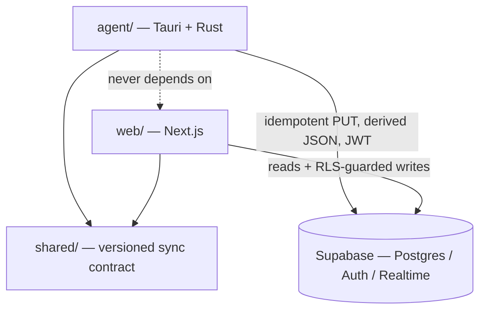
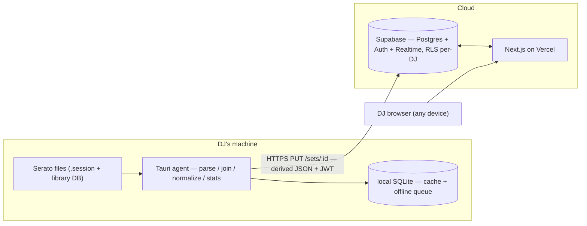
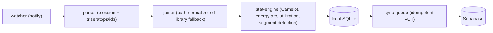
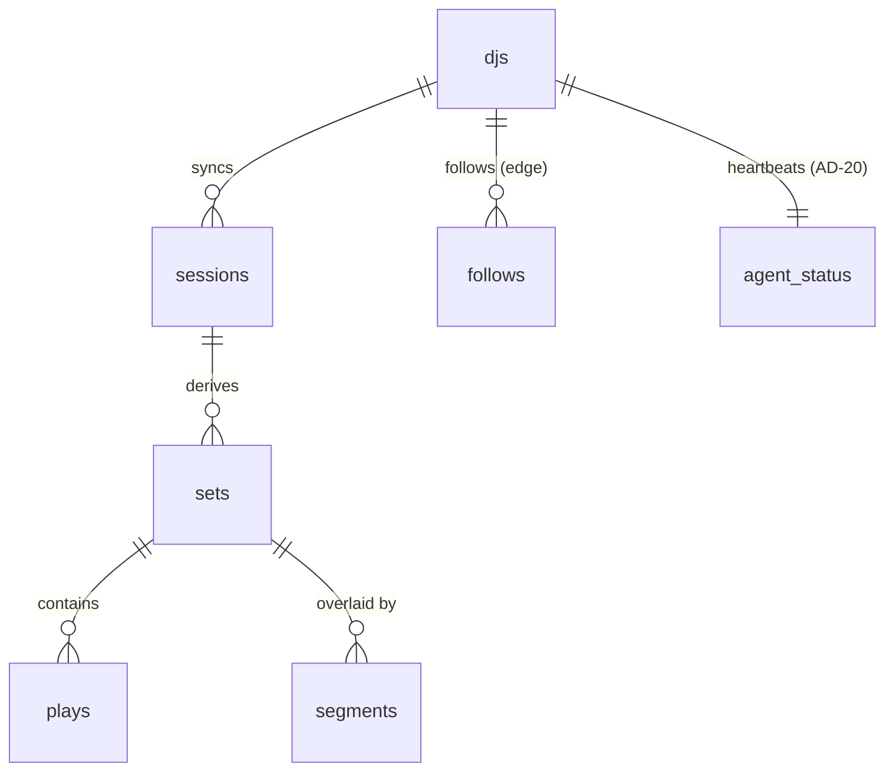

# Architecture Spine — Curfew

## Design Paradigm

**Local-first hybrid — "smart edge, thin cloud."** The DJ's machine is not a dumb uploader; it is where every expensive operation happens. The cloud is a comparatively thin store-and-serve tier plus a social graph. This is the direct architectural expression of the product's defining fact — *no paid AI or server compute is needed; all stats are arithmetic over parsed metadata* — so all that computation runs for free on hardware the business does not own.

Two units, one seam:

- **The agent** (`agent/`) is a **pipes-and-filters** pipeline: `watcher → parser → joiner → stat-engine → local store → sync-queue`. Each filter is independently testable with a typed hand-off.
- **The cloud** (`web/` + Supabase) is a **modular monolith** — one Next.js deployment over a managed Postgres, not microservices.
- The **sync boundary** between them is the single load-bearing integration in the system. A shared, versioned contract (`shared/`) governs it.

Everything below fixes the invariants of that seam and the two units it joins. The full data schema, component internals, and file tree are **seed** — true at cold-start, owned by the code once it exists.

## Invariants & Rules

Dependency direction (who may depend on whom):



**Rule:** `agent` and `web` both depend on `shared`; neither depends on the other; both reach the cloud only through the contracts above; the cloud (Supabase schema + RLS) depends on nothing upstream.

### AD-1 — Edge computes, cloud stores `[ADOPTED]`

- **Binds:** all stat/derivation features (FR-2, FR-6–FR-13, FR-15); every cloud read path.
- **Prevents:** a server-side recomputation path growing beside the edge one, so the two disagree and paid server compute creeps in.
- **Rule:** the **edge owns everything derived from raw Serato data** — parsing, the session↔library join, base per-track metadata, genre normalization, and first-pass per-set stats — and the cloud **never parses Serato binary or re-derives base metadata**. The cloud **may** run **SQL re-aggregation over already-synced `plays`**: user-defined slices (FR-15 segment-scoped stats — segments live only in the cloud, AD-6), cross-DJ **scene aggregates** (FR-24/FR-25, Phase 2), and **re-applying the genre-normalization lookup** over the stored raw genre string (AD-12, pinning one `taxonomy_version` per aggregate across a heterogeneous fleet). The line is **raw-Serato derivation (edge-only)** vs **SQL over clean synced rows (cloud-legal)** — not "no cloud compute."

### AD-2 — Raw-data boundary `[ADOPTED]`

- **Binds:** FR-3, FR-5; §5.2 Privacy; the sync payload.
- **Prevents:** the cloud ever ingesting Serato's binary format — which would pull format-coupling and raw-library privacy liability server-side.
- **Rule:** raw `.session` files and the raw library DB **never leave the machine**. Only a derived, normalized JSON document per set crosses the wire, over HTTPS. Agent filesystem access is capability-scoped to the configured Serato path only.

### AD-3 — Derived-only sync through one shared, versioned contract `[ADOPTED]`

- **Binds:** the agent↔cloud seam; `shared/`; FR-4.
- **Prevents:** agent and web independently defining incompatible payload shapes; the contract drifting between tiers.
- **Rule:** the per-set sync payload is a single versioned schema owned by the `shared/` package (TS types + JSON-schema), validated on **both** the agent (before send) and the cloud (on receive) by contract tests. The three tiers live in **one monorepo** (`agent/`, `web/`, `shared/`) precisely so this contract cannot fork. Every payload carries `agent_version`. **Contract evolution is additive-only** (new optional fields; never a breaking change to a live field), and the cloud **must accept the last N `agent_version`s** — a heterogeneous agent fleet is expected, because AD-13 backfill re-syncs sets from older agents.

### AD-4 — Idempotent sync on a deterministic `set_id`

- **Binds:** FR-4; the sync-queue filter; the backfill playbook.
- **Prevents:** duplicate sets on retry **and on re-parse/backfill** — the exact case the raw-retention story (AD-13) depends on.
- **Rule:** sync is an idempotent `PUT /sets/:set_id`. `set_id` is **deterministic and namespaced by `dj_id`** — derived as `hash(dj_id, session_identity)` (see AD-16), never minted fresh per parse (a random UUID would duplicate on backfill) and never derived from session identity alone (two DJs on a shared USB library would collide). Re-parsing the same session after a parser fix therefore **updates content** rather than duplicating. Offline sets queue durably in local SQLite and sync on reconnect (at-least-once + idempotent = no dupes). *(Architect call — research specified idempotency but left key-derivation open.)*

> **Two distinct meanings of "backfill" in this document — do not conflate them.** (1) **Reprocess-backfill** (this entry, AD-13): re-syncing a set Curfew *already captured*, after a parser fix — idempotency-safe by design, no product-scope question. (2) **Historical-import backfill** (PRD §1 Decision A, 2026-07-25): bulk-importing a DJ's pre-existing `History/Sessions`/`master.sqlite` from *before* they subscribed. **This is explicitly out of scope at launch** — ingestion is go-forward only. AD-4's idempotent `set_id` design does not preclude historical-import backfill technically (the hash would key it fine), but the product decision is to never build it: the empty/sparse dashboard is the intended launch experience, and the resulting unfillable gap on cancellation is the retention moat. If historical-import backfill is ever revisited post-launch, it is a new story against this same idempotent-sync foundation, not a spine change.

### AD-5 — Two stores, one owner per data class

- **Binds:** local SQLite; cloud Postgres; cross-device access.
- **Prevents:** two-owner divergence when a DJ runs the agent on more than one machine (laptop + studio, or a USB-hosted library moved between machines).
- **Rule:** **cloud Postgres is the cross-device system of record** for all synced and social data. **Local SQLite is a durable parse + offline cache** and is the source of truth for a set **only until that set has successfully synced**. *(Architect call — tightens the research's looser "local = truth for the DJ's own data," which left a two-owner hole across devices.)*

### AD-6 — Set content flows one way; user overlays are cloud-only

- **Binds:** FR-14, FR-16, FR-22, FR-23; the agent write path.
- **Prevents:** bidirectional sync and edit-conflict machinery between agent and cloud.
- **Rule:** set **content** (plays, timestamps, derived stats) flows **agent → cloud only**. User-authored **overlays** — Layer 2 enrichment (FR-16), segment edits (FR-14), per-track hide (FR-22), visibility tier (FR-23) — are authored on the web, live **only in the cloud**, and are **never written back to the agent**. The agent emits an immutable "as-played" set; overlays accrete server-side. The agent's upsert is **column-scoped to content** and never touches an overlay column (enforced per AD-16). *(Architect call.)*

### AD-7 — Per-DJ isolation is enforced at the database layer `[ADOPTED]`

- **Binds:** all DJ-owned tables; §5.2 Privacy.
- **Prevents:** a cross-DJ data leak surviving any application-code or API bug.
- **Rule:** isolation is a Row-Level Security policy, **null-safe**: `auth.uid() IS NOT NULL AND auth.uid() = dj_id`. Never application-layer filtering. Phase 2 social sharing is added as **explicit opt-in read policies** on top; isolation-by-default is never relaxed to achieve it.

### AD-8 — All cloud mutation goes through Supabase + RLS `[ADOPTED]`

- **Binds:** every write path except set sync.
- **Prevents:** a bespoke write-API that quietly bypasses RLS.
- **Rule:** web-side mutations (enrichment, hide, visibility, follow) go through Supabase (PostgREST / `supabase-js`), guarded by RLS. No custom mutation server at v1. The agent's **only** write is the idempotent set sync (AD-4) — except **three** named, table-scoped amendments to this rule: the AD-20 status heartbeat, the AD-21 library add-event batch, and the AD-22 library roster batch. Any further agent write requires the same treatment (a named AD entry, its own `SECURITY DEFINER` RPC, its own table, no DJ write grant); an unnamed fourth write is a violation of this rule, not a precedent set by the first three.

### AD-9 — Visibility tiers + per-track redaction; plays inherit set visibility `[ADOPTED]`

- **Binds:** FR-22, FR-23; §6.2 tone.
- **Prevents:** a hidden track leaking through track-count or omission; visibility enforced only in the UI.
- **Rule:** three tiers — **public / friends-only / private** — enforced by RLS read policies. Per-track hide renders as a **redacted placeholder, never an omission** (FR-22). A `play` has **no independent visibility**; it inherits its set's tier. Default-on-sync is **public**, but this applies **only to sets synced after a DJ has joined the social layer**. **Phase 1 sets are stored private-equivalent and are never retroactively exposed when Phase 2 read-policies ship** — no historical privacy shock. A tier, once set by the DJ, is never changed by an agent re-sync (AD-16).

### AD-10 — One account across providers; agent stores tokens securely `[ADOPTED]`

- **Binds:** FR-29; §4.10.
- **Prevents:** a duplicate account per auth provider; the agent persisting a refresh token in browser-style storage.
- **Rule:** Supabase Auth (GoTrue is now its legacy internal name), JWT + refresh. Four sign-in paths (email+password, Google, Apple, passkey) **link to one `dj` account by verified email**; a phone number is required on file (prompted after Google/Apple signup); the `djs` row is 1:1 with `auth.users`. The agent persists its refresh token via **Tauri's overridable secure storage**, not browser storage. `djs`-row creation is **idempotent on verified email** — a second provider with the same verified email always links to the existing row, never creating a duplicate that would strand synced history. Accounts with **distinct** verified emails across providers are **not auto-merged in v1** (a known limitation, flagged rather than silently merged).

### AD-11 — Agent = Tauri/Rust with a two-path parser `[ADOPTED]`

- **Binds:** FR-1, FR-2; the `parser`/`joiner` filters.
- **Prevents:** parsing as a foreign-process call; floating a volatile dependency; assuming a single Serato DB format.
- **Rule:** the agent is **Tauri 2 (Rust core)**. Parsing is **two paths**: a **clean-room Rust `.session` parser** (the play log) + **`triseratops`** (MPL-2.0 confirmed; **pin an exact git commit** — the published crate is stale at `0.0.3`/2023 and upstream warns of breaking API changes) and the **`id3` crate** for the library DB and embedded tags. It must handle **both** legacy `database V2` **and** Serato 4+ `master.sqlite`. The session↔library join resolves relative-vs-absolute paths against the library root; off-library tracks fall back to embedded tags, then to a visible **"Unknown"** (never a guess, never a silent drop).

### AD-12 — Normalize genres on the edge, but store raw + normalized + taxonomy version

- **Binds:** FR-8, FR-9, FR-24.
- **Prevents:** silent cross-time trend corruption when the normalization table evolves across an already-deployed agent fleet (old sets normalized under table vN, new sets under vN+1, compared as if equal).
- **Rule:** genre normalization runs **on the agent** before sync against a Curfew-maintained fixed table (FR-8, not DJ-editable). The cloud stores **both** the raw genre string **and** the normalized value **and** a `taxonomy_version` per play, so trends (FR-9) can be recomputed consistently after the table changes. *(Architect call.)*

### AD-13 — Format-drift resilience is three layers plus backfill `[ADOPTED]`

- **Binds:** FR-1 feature NFR; §5.4 Reliability; the ops posture.
- **Prevents:** a Serato format change silently corrupting synced data with no way to recover.
- **Rule:** (1) **golden-file CI tests** against checked-in `.session` + DB fixtures catch drift pre-release; (2) **agent-side error reporting tagged with `agent_version`** detects drift that only appears on a real DJ's machine post-release; (3) a **signed static-JSON auto-updater** (Tauri) ships the fix fast. Because local SQLite retains raw data (AD-5), affected sets are **backfilled** after the fix. All three layers are required — field validation alone only covers pre-release.

### AD-14 — Cloud is a modular monolith `[ADOPTED]`

- **Binds:** `web/`; the cloud tier.
- **Prevents:** premature microservices; a hand-built socket server or custom API layer.
- **Rule:** one Next.js deployment over Supabase. The read/serve API is **auto-generated by PostgREST**; the Phase 2 scene feed rides **Supabase Realtime** (managed WebSockets), not a socket server you operate. Future service seams (heavy analytics, Rekordbox/Engine ingestion) are **named, not built** (see Deferred).

### AD-15 — Phase 1 → Phase 2 is additive, never a rewrite

- **Binds:** the whole schema + boundary set; PRD §9 phasing.
- **Prevents:** a Phase 1 shape that forces restructuring when social lands — which would forfeit the entire reason Topology B was chosen over a simpler local-only build.
- **Rule:** the Phase 1 schema, sync contract, and boundaries are chosen so Phase 2 (feed, follows, visibility tiers, comparisons) **adds** fields, RLS read-policies, and Realtime subscriptions — it never restructures existing tables or the sync contract. **Enforcement arm:** schema changes ship as **additive-only Supabase-CLI migration files committed in the monorepo**; a migration that drops/renames a live column or breaks the sync contract violates this AD. *(This is a product-phase invariant, distinct from the engineering build-sequence: parser → local app → sync → web → social.)*

### AD-16 — Session is the immutable anchor; sets & overlays key off it; the agent upsert is content-only

- **Binds:** FR-1, FR-4, FR-14–FR-16, FR-22, FR-23; the sync upsert; AD-4, AD-6, AD-9.
- **Prevents:** a parser/boundary fix orphaning overlays or silently re-exposing a private set; two DJs on a shared USB library colliding on one set; an idempotent content re-sync clobbering web-authored visibility/enrichment.
- **Rule:**
  - The **session** (one Serato session file) is the immutable identity anchor: `session_id = hash(dj_id, stable_session_identity)` — **namespaced by `dj_id`** so a shared USB library cannot collide across DJs (AD-4). `stable_session_identity` **must** be derived from a stable, intrinsic property of the session itself — its immutable start-anchor / first-play identity — **never** file mtime, path, or filename, so a later Serato re-save of the same session never re-keys or duplicates the set, and two distinct same-night sessions never collide. *(Resolved 2026-07-20, party — refines this AD; enforced as a contract test per epics.md Story 3.2 AC-6.)*
  - A **set** is a product unit derived from a session (Glossary §3). Set boundaries, **once synced, are stable in the cloud**: a re-parse/backfill updates play-level content keyed by `session_id` but **does not re-partition or re-key** an already-synced session. Correcting boundaries is a **deliberate cloud-side migration**, never an implicit consequence of re-sync.
  - The agent's sync upsert is **column-scoped to content columns**. User-authored **overlay** columns — visibility tier, per-track hide, Layer 2 enrichment, segments — are **disjoint and never written by the agent** (the mechanical enforcement of AD-6, contract-tested in `shared/`). An idempotent re-sync can therefore never reset a tier (AD-9) or wipe an overlay.

### AD-17 — Segment detection: density + DJ-relative BPM floor, confirmed by transition-smoothness `[ADOPTED]`

- **Binds:** FR-14, FR-15, FR-27, FR-28; the agent's stat-engine filter; segment suggestion (feeds AD-6's web-authored overlay).
- **Prevents:** a fixed global BPM/gap constant that fits one DJ's genre and silently misfires on another; assuming every session has exactly one dancefloor block to find; a coincidentally similar-tempo non-mixed block (dedications, ambiance) being misread as a real set.
- **Rule:** the agent buckets a session into fixed time windows and computes, per window, **play density**, **median BPM**, and the **fraction of consecutive track-pairs with a small BPM delta** (a continuity/beatmatching proxy). A window is a dancefloor *candidate* only if density and BPM clear floors **calibrated per-DJ from that DJ's own historical plays** — never a hardcoded global constant (a house DJ's floor sits far above a hip-hop DJ's). Adjacent candidates merge into a segment, which is **confirmed** only once its transition-smoothness clears its own floor: validated against the real session corpus, an isolated non-mixed ceremony stretch measured ~42% smooth transitions against ~65–78% for confirmed real mixed sets, so smoothness is used as a **confirming gate**, not the primary signal — it did not separate cleanly on its own in every case tested (a formalities block can coincidentally score as "smooth" too). Long no-play stretches collapse to an **idle/gap** marker, never a forced segment. **A session yields zero, one, or several dancefloor segments — never assumed to be exactly one**: validated against a real 8.6-hour session that bundled a morning dancefloor block, a multi-hour non-dancefloor stretch, and a separate evening dancefloor block, because Serato was never closed between the underlying real-world events (e.g. a baraat, then the ceremony, then the reception). *(Architect call, validated 2026-07-20 against the real 474-session local corpus — resolves SM-1/OQ#1.)*

### AD-18 — Stripe Checkout; the webhook route handler is the one sanctioned AD-8 exception `[ADOPTED]`

- **Binds:** Epic 7 (Subscription & Billing); the billing write path.
- **Prevents:** a hand-rolled payment form/subscription state machine; the webhook landing on a second runtime/deployment surface; an ambiguous or duplicated write path for subscription state; a duplicate or out-of-order Stripe webhook delivery corrupting subscription state; a webhook event writing to the wrong DJ's row.
- **Rule:** billing runs on **Stripe Checkout** (hosted checkout page + trial support + self-serve Customer Portal for manage/cancel) — no bespoke payment UI. The webhook is a **Next.js Route Handler in the existing `web/` deployment on Vercel**, pinned to the **Node.js runtime (not Edge)** so Stripe's synchronous signature verification works without the Edge-only async crypto provider — a second runtime for one webhook would contradict AD-14's "one Next.js deployment, no premature microservices." The handler authenticates the request via **Stripe's signature** (raw body + signing secret via `stripe.webhooks.constructEvent`), not a Supabase JWT.
  - **`dj_id` linkage:** because Checkout is only reachable by an already-authenticated DJ (AD-10 — the account already exists before a subscription can start), the Checkout Session is created carrying `client_reference_id` / `metadata.dj_id` = that DJ's id. The webhook resolves `dj_id` **from the event's own metadata**, never by re-deriving identity from email or a customer lookup — closing the "which `djs` row" ambiguity that a distinct-email or pre-verification edge case (AD-10) could otherwise create.
  - **Idempotency:** the handler dedupes on Stripe's own `event.id` before applying any state change (Stripe redelivers at-least-once, unordered), and on a subscription-changed event it treats the payload as a cue to **re-fetch the canonical subscription object from the Stripe API** rather than trusting the event's field values verbatim — so a stale, out-of-order retry can never resurrect an already-canceled subscription. (The same class of problem AD-4 solves for the sync path, solved here for the billing path.)
  - **Mechanical write-scoping:** the webhook writes through a single **Postgres `SECURITY DEFINER` function** (e.g. `apply_subscription_event(...)`) that touches **only** the four AD-19 billing columns — never a raw table `UPDATE` from server code — so "billing columns only" is enforced in the database, the same way AD-16 contract-tests the agent's content-column scoping. This function is the **only** caller of the elevated key from billing code. *(Naming note: Supabase is mid-migration off the legacy `service_role` key to `sb_publishable_…`/`sb_secret_…` API keys — new projects stopped receiving the legacy key in late 2025 — so confirm the current key type for this project at implementation time rather than assuming `service_role`.)*
  - The free-trial window is sourced from Stripe's native `trial_period_days` on the Checkout Session, not a hand-rolled trial tracker (avoids a second source of trial-state truth); the trial length itself (recommended default: 14 days) is a business parameter set in Stripe config, not an architecture decision.
  - **One Stripe customer per `dj_id`:** Checkout Session creation must first look up `djs.stripe_customer_id` for the authenticated `dj_id` and, if present, reuse it (Stripe's `customer` param) rather than minting a fresh Stripe Customer. Only when no `stripe_customer_id` is on file does Checkout create a new one. This prevents a DJ who ends up with more than one `djs` row (AD-10's known distinct-verified-email gap) from drawing a fresh 14-day trial per row. *(Resolved 2026-07-21, Arjun — billing review Finding 7.)*
  - **API version pin:** the integration pins an explicit Stripe API version (the then-current stable version at implementation time, set via the SDK's version config / `Stripe-Version` header) rather than riding the Stripe account's default version, matching the same pin-don't-drift discipline this spine applies to `triseratops`. *(Resolved 2026-07-21, Arjun — billing review Finding 4.)*

### AD-19 — Subscription state is additive on `djs`, DJ-write-excluded; the access gate binds the web experience only, never the agent `[ADOPTED]`

- **Binds:** Epic 7; the `djs` schema; the `djs` RLS write policy; the web route-guard layer; AD-4's sync endpoint (explicitly exempted).
- **Prevents:** billing logic leaking into the edge↔cloud sync contract (AD-3) or the idempotent sync path (AD-4); an implementer gating sync "for consistency" with the web paywall (including by accident, via a shared Next.js middleware matcher); a reinterpreted subscription-status enum drifting from Stripe's own state; a DJ's own authenticated session writing or forging its own billing state through a future DJ-writable update policy on `djs`; `subscription_status` bleeding into Phase 2 social-visibility logic that AD-9 already governs.
- **Rule:** four nullable columns are added to `djs` as an **additive-only migration** (AD-15): `stripe_customer_id`, `stripe_subscription_id`, `subscription_status`, `current_period_end`. `subscription_status` stores **Stripe's own status string verbatim** (`trialing`/`active`/`past_due`/`canceled`/`unpaid`/`paused`/`incomplete`/…) — the webhook is a thin passthrough, never a second state machine; the column is `text`, not a restrictive DB enum, so a Stripe status added later never breaks the write. There is no separate trial-end column: while `subscription_status = 'trialing'`, `current_period_end` **is** the trial end. Existing per-DJ RLS (AD-7) already covers a DJ **reading** their own new columns. **No RLS `UPDATE` policy on `djs` ever grants a DJ write access to these four columns** — the only writer is AD-18's `SECURITY DEFINER` function, invoked by the webhook; if `djs` later gains any DJ-writable update policy (e.g. display name), that policy's column grant list must explicitly exclude the four billing columns. **Hard invariant:** the access gate restricts **the web experience only**. The agent's local capture (parse → local SQLite → sync-queue) and the idempotent set-sync endpoint (`PUT /sets/:set_id`, AD-4) are **never** gated by `subscription_status` — billing state is invisible to the agent and to the sync contract. A lapsed subscriber's agent keeps parsing and queuing every set locally and **resumes syncing on reactivation with no data loss**; only web routes serving the dashboard/stats check `subscription_status`. **Sync-endpoint isolation (structural, not just textual):** the cloud-side contract validation AD-3 requires for `PUT /sets/:set_id` on receive must **not** be implemented as a Next.js Route Handler living in the same route tree as the Epic 7 paywall-gated dashboard routes — implement it as a Postgres-side mechanism (trigger/extension) in front of PostgREST instead. This closes the seam where a blanket auth/subscription middleware matcher written for the web paywall (e.g. `matcher: ['/api/:path*']`) could net the sync route by accident, even though no line of Epic 7 code ever mentions "sync." *(Resolved 2026-07-21, Arjun — billing review Finding 5.)* **Phase 2 social reads:** `subscription_status` must never appear in any Phase 2 social read-policy or feed query (follows, feed, other DJs' profiles, comparisons — FR-19–26). Visibility of another DJ's content is governed exclusively by AD-9's public/friends/private tiers — a lapsed or non-subscribing DJ's own paywall status never hides or reveals *other* DJs' content, and a DJ's own subscription lapsing never makes their previously-public sets disappear from other people's feeds. *(Resolved 2026-07-21, Arjun — billing review Finding 6.)*

### AD-20 — Agent-status heartbeat is the second sanctioned agent write, status-column-scoped `[ADOPTED 2026-08-04]`

- **Binds:** FR-4, FR-5; UX-DR19's "Dashboard status" half; the agent write path; AD-8 (explicitly amended).
- **Prevents:** the dashboard silently lying about sync health (no signal channel existed — deferred in Stories 3.3/3.3b); *and* an ad-hoc second agent write growing outside a named, column-scoped, RLS-safe boundary.
- **Rule:** AD-8's "the agent's only write is the idempotent set sync" is amended to admit **exactly one** additional write: a compact **status heartbeat**. The agent writes its current tray state (Idle/Syncing/Failed/DriveNotConnected/Queued/FormatDriftPaused) through a single `SECURITY DEFINER` RPC (`set_agent_status`) that derives `dj_id` from `auth.uid()` and touches **only** the `agent_status` row's status columns — never `sets`/`plays`/overlays/billing. `agent_status` is per-DJ, owner-SELECT via RLS (AD-7), with **no DJ write grant** (the RPC is the only writer), mirroring AD-18/AD-19's webhook exception. The heartbeat is **fire-and-forget and never blocks or gates set sync**, carries no derived Serato data (AD-1/AD-2 untouched), does **not** change the frozen `shared/` sync-payload contract (AD-3 — it is a separate endpoint), and is **never gated by `subscription_status`** (AD-19 — a lapsed subscriber's agent still heartbeats). `sync_state` stores the tray-state string verbatim (`text`, not a DB enum), validated against the allowed set inside the RPC. The heartbeat **fires on every idle drain pass of the existing `sync_queue::sync_loop` — not only on state change** — so a fresh `updated_at` is the agent's liveness signal; this adds **no new poll loop** (it rides a loop that already runs at `BASE_INTERVAL` 30s → `MAX_INTERVAL` 300s). The agent is deliberately dumb about staleness: the **dashboard** owns the definition, treating a heartbeat older than `600s` (2× `MAX_INTERVAL`) as "not reporting," never as synced.

### AD-21 — Library add-event batch is the third sanctioned agent write, table-scoped `[ADOPTED 2026-08-07]`

- **Binds:** FR-10, FR-11; Epic 4 Stories 4.2/4.3; the agent write path; the `library_track_events` table; AD-8 (explicitly amended, for the second time after AD-20); AD-3/AD-15 (the additive `shared/` change this rests on).
- **Prevents:** FR-10 and FR-11 having **no denominator at all** — the frozen contract only ever carried a track's add-date per *play* (`SyncPlay.library_added_at`), so a track added but never played was invisible to the cloud, and "share of recently-added tracks that appear in sets" was literally uncomputable (Story 1.10, Open Question #1, deferred to whichever Epic 4 story implemented FR-10); *and* a second ad-hoc agent write growing outside a named, RLS-safe boundary the way AD-20 was written to prevent the first time.
- **Rule:** AD-8's "the agent's only write is the idempotent set sync" is amended to admit a **second** additional write, alongside AD-20's heartbeat: a **library add-event batch**. The agent writes through a single `SECURITY DEFINER` RPC (`sync_library_add_events`) that derives `dj_id` from `auth.uid()` — never accepting it as a parameter — and touches **only** `library_track_events`; never `sets`/`plays`/overlays/billing. That table is per-DJ, owner-SELECT via RLS (AD-7), with **no DJ write grant** (the RPC is the only writer), mirroring AD-20's and AD-18/AD-19's shape exactly. The write is **idempotent on `(dj_id, track_id)` and first-write-wins**: a redelivery from the at-least-once offline queue is a no-op, and a later scan taken with a drive unmounted can never overwrite a resolved `added_at` with `null`. It **rides the existing `sync_queue::sync_loop`** — no new poll loop, no second backoff — and, like the heartbeat, is **never gated by `subscription_status`** (AD-19).
- **Go-forward only, never a backfill.** Track identity is `fnv1a_hex` of normalized title+artist (`capture.rs::track_id_from_title_artist`, Story 4.3 Decision E-2) — the "purpose-built (possibly hashed/opaque) per-track identity field" Story 1.10 anticipated. Originally the volume-root-relative path (D-2); rewritten by Story 4.3 because a path-keyed identity split the same song across two unrelated ids whenever it lived on more than one drive (a laptop copy and a gig USB), which on real data deflated whole cohorts' worth of conversion-rate months to 0% (`deferred-work.md:262`). **Neither the raw path nor the raw title/artist ever cross the seam** (AD-1/AD-2 untouched; same posture that already excludes `EnrichedPlay.path` from `SyncPlay`). On an agent's first-ever run the DJ's existing library is recorded as a **silent local baseline that is never synced**, so a DJ who has dug for a decade never sees their back-catalogue appear as "added this month"; only tracks first seen on a *later* scan are add-events. This extends Epic 4 Decision B's existing go-forward frame from plays to adds, and no mechanism anywhere reconstructs when an already-present track was acquired. A catalogued track with no resolvable title or artist has no identity to record under and is silently excluded from the scan entirely (never a fabricated partial-input identity, AD-11).
- **Contract impact:** additive only (AD-15). `SyncPlay` gains an optional `track_id`, and `SyncLibraryAddEvent`/`SyncLibraryAddEventBatch` are a **separate** payload with their own JSON schema — not a field on `SyncPayload`, because an add-event is not set-scoped and `SyncPayload` is one-`PUT`-per-set (AD-4). The `PUT /sets/:set_id` idempotency contract is untouched.
- **Status:** `[ADOPTED]` — ratified by Arjun 2026-08-07. Implemented in Story 4.2, recorded here rather than left implicit in code (the ai-6 failure mode: a decision this consequential propagating nowhere). Ratification covers the write mechanism (RPC shape, RLS scoping, idempotency, go-forward-only posture) — §194's identity clause is being rewritten separately as part of the title+artist identity switch and does not need re-ratification once updated.

### AD-22 — Library roster batch is the fourth sanctioned agent write, table-scoped, current-state `[ADOPTED 2026-08-07]`

- **Binds:** FR-10, FR-11 (indirectly, via naming what AD-21 can only count); Epic 4 Story 4.11; the agent write path; the `library_roster` table; AD-8 (explicitly amended, for the third time after AD-20 and AD-21); AD-3/AD-15 (the additive `shared/` change this rests on).
- **Prevents:** the cloud being able to COUNT an added-but-never-played track (AD-21) but never NAME one — `library_track_events` and `SyncLibraryAddEvent` carry only `{ track_id, added_at }`, so Story 4.3's meter cannot show the 66% it can't call "converted," Story 4.4's aging shelf would render a list of hashes with a prep-crate action attached to nothing, and Story 4.10's search cannot reach an unplayed track at all; *and* a third ad-hoc agent write growing outside a named, RLS-safe boundary the way AD-20 was written to prevent the first time.
- **Rule:** AD-8's "the agent's only write is the idempotent set sync" is amended to admit a **third** additional write, alongside AD-20's heartbeat and AD-21's library add-event batch: a **library roster batch**. The agent writes through a single `SECURITY DEFINER` RPC (`sync_library_roster`) that derives `dj_id` from `auth.uid()` — never accepting it as a parameter — and touches **only** `library_roster`; never `sets`/`plays`/`library_track_events`/overlays/billing. That table is per-DJ, owner-SELECT via RLS (AD-7), with **no DJ write grant** (the RPC is the only writer), mirroring AD-20/AD-21's shape exactly. It **rides the existing `sync_queue::sync_loop`** — no new poll loop, no second backoff — and, like the heartbeat and the add-event batch, is **never gated by `subscription_status`** (AD-19).
- **Current-state, not first-write-wins — the one deliberate divergence from AD-20/AD-21's shape.** The roster is idempotent on `(dj_id, track_id)` like AD-21's batch, but unlike it the RPC's `title`/`artist`/`absent_at` columns are `DO UPDATE`, not `DO NOTHING`: a re-tagged track (a genre fixed, a key set — Tier B fields not carried here, but the tag-refresh discipline is the same) must be reflected, because the roster describes what the DJ owns *now*, not an immutable as-recorded event. **`added_at` and `is_baseline` are the one exception and stay first-write-wins even inside this current-state table** — they are set only on the row's initial insert and never appear in the RPC's `DO UPDATE` clause, because a re-scan silently moving a track's baseline/go-forward classification would retroactively populate old conversion-rate cohorts against a still-go-forward numerator and change numbers the DJ has already seen (the exact hazard this AD exists to keep out of `library_track_events`, transplanted into a new table if this were gotten wrong).
- **Carries baseline tracks — the one thing AD-21's batch structurally cannot.** D-1's silent first-run baseline snapshot is excluded from `library_track_events` by construction (AD-21), but this roster's whole purpose requires the opposite: a DJ's entire pre-install back-catalogue must be nameable too, or the three consumers above are only ever partially unblocked. **`library_roster` and `library_track_events` stay two separate tables serving two separate purposes and must never be conflated or merged** — the roster's `added_at`/`is_baseline` must never be read for conversion-rate cohort math; `library_track_events` remains the only cohort denominator.
- **Tier A only.** Carries `track_id`, `title`, `artist`, `added_at`, `is_baseline`, `absent_at` — deliberately no `bpm`/`key`/`genre` (Tier B). Those fields require a real whole-library enrichment pass against NFR-1's ≤10s p95 budget to cover the unplayed catalogue and buy exactly one thing (the coverage-gap components); parked, not built here. Neither the raw path nor the raw title/artist text differ in privacy category from what already crosses the seam per play (`SyncPlay.title`/`.artist`) — this is a change in *volume* (the whole roster, not just played tracks), not *category*, ruled acceptable against Story 2.7's local-only raw-data boundary (2026-08-07, Arjun, party mode).
- **Soft-delete, never a hard removal.** A track missing from a scan gets `absent_at` set (agent-side: `store::mark_absent_tracks`); reappearance clears it. Nothing before this AD tracked library removal at all — without it, Story 4.4's aging shelf would recommend prepping a track the DJ already deleted.
- **Single-install assumption — a stated limit, not an oversight.** `library_roster` is keyed `(dj_id, track_id)` with no installation scoping, the same assumption `agent_status` (AD-20) already makes with its `dj_id`-primary-key row. Nothing in the auth model enforces it: `auth::store`'s keyring guarantees *one DJ per agent*, but not *one agent per DJ*, and there is no unlink path — so a DJ who links a laptop and a studio machine gets two live installs. For AD-20 that is benign (a status row, last writer wins). For this table it is destructive: each install marks the other's tracks `absent_at` and clears its own, so the roster oscillates and never converges, and Story 4.4's aging shelf reads the result. **Ruled 2026-08-07 (Arjun, Story 4.11 code review): enforce one linked machine per account, post-MVP** — tracked in `deferred-work.md`. Per-installation identity is the alternative design if multi-machine is ever wanted instead; either way this must be settled before a second install is possible in the wild.
- **Contract impact:** additive only (AD-15). `SyncLibraryRosterEntry`/`SyncLibraryRosterBatch` are a **third**, wholly separate payload with their own JSON schema (`sync-library-roster.schema.json`) — not a field on `SyncPayload` or on `SyncLibraryAddEventBatch`. Neither the `PUT /sets/:set_id` idempotency contract nor `sync_library_add_events`'s contract is touched.
- **Status:** `[ADOPTED]` — ratified by Arjun 2026-08-07 (the same session that measured this story's Tier A/B cost split). Implemented in Story 4.11, recorded here rather than left implicit in code (the ai-6 failure mode AD-21 already names).

## Consistency Conventions

| Concern | Convention |
| --- | --- |
| Entity naming | `djs`, `sets`, `plays`, `segments`, `follows`, `agent_status` (plural/snake_case). A `Session` is Serato's file-level unit; a `Set` is the product unit derived from it (Glossary §3) — never conflated. `agent_status` keeps the snake_case convention but is a **1:1 per-DJ status row** (PK = `dj_id`), upserted, not an appended event log (AD-20). |
| IDs | UUID. `set_id` is agent-generated and **deterministic** (AD-4); all others DB-generated. `dj_id` = `auth.uid()`. |
| Dates / times | **Agent→cloud RPC arguments carry Unix epoch seconds** (integers), which every `SECURITY DEFINER` write path parses with `to_timestamp(...::bigint)` — `sync_set`, `sync_library_add_events` (AD-21), `sync_library_roster` (AD-22). **UTC ISO-8601 is the read-model/web-facing shape**, which PostgREST renders from the stored `timestamptz` automatically. `played_at` sourced from the session file. *(Corrected in Story 4.11's code review: this row previously said "UTC ISO-8601 on the wire" flatly, which no sync path has ever done — the `shared/` schemas encoded the aspiration and the producers all sent epochs, so the contract artifacts described a payload nothing could parse.)* |
| Sync payload | The `shared/` versioned schema is the only contract shape; `agent_version` on every set (AD-3). |
| Unknown data | Missing metadata renders as a visible **"Unknown"**, carrying the `in_library` flag — never omitted, never guessed (AD-11; SM-C1 keeps the Unknown rate honest). |
| Cloud mutation | Supabase/PostgREST + RLS only; agent writes only via idempotent set sync (AD-8). Four named exceptions, each scoped by a `SECURITY DEFINER` function to its own table/columns: the Stripe webhook route handler, billing columns only (AD-18); the agent's status heartbeat, the `agent_status` row only (AD-20); the agent's library add-event batch, `library_track_events` only, first-write-wins (AD-21); and the agent's library roster batch, `library_roster` only, current-state upsert on title/artist/absent_at but first-write-wins on added_at/is_baseline (AD-22). |
| Auth / tokens | Supabase JWT + refresh; agent token in Tauri secure storage (AD-10). |
| Errors (agent) | Reported to error tracking tagged with `agent_version` (AD-13); user-facing copy is calm/technical per EXPERIENCE.md Failure Register ("Sync interrupted. Retrying automatically."). |
| Errors (wire/API) | JSON error envelope `{ code, message }` (PostgREST/Supabase error shape); the agent maps these to the calm Failure-Register copy — never surfaces a raw provider error. |
| Enums (canonical values) | `visibility` ∈ {`public`, `friends_only`, `private`}; segment `type` ∈ {`dancefloor`, `dinner`, `performance`, `custom`}; `source` = `serato` (v1); `subscription_status` = Stripe's own subscription-status string, passed through verbatim (AD-19), not redefined here. Fixed strings, defined once in `shared/`. |

## Stack

*Seed — verified current at authoring; the code owns this once it exists.*

| Name | Version |
| --- | --- |
| Tauri | 2.x |
| Rust | stable (agent core + parsers) |
| triseratops | pinned **git commit** (MPL-2.0; crates.io latest `0.0.3` is stale/2023) |
| id3 (crate) | current |
| Local store | SQLite (via Tauri/Rust) |
| Next.js | 16 |
| React / TypeScript | current |
| Supabase | Postgres + Auth + Realtime + Storage |
| Email delivery | Resend (or equivalent transactional email API) — configured via Supabase Auth's custom SMTP |
| Stripe | Checkout + Customer Portal + Webhooks (subscriptions API); **pinned API version** (not account-default, AD-18) |
| Web host | Vercel |
| CI / release | `tauri-action` (GitHub Actions) |
| Update feed | static-JSON on GitHub Releases / S3 |

> Verify current versions and code-signing pricing (Apple Developer Program; Windows OV/EV cert) before committing a launch budget — the two signing identities are the dominant *fixed* cost, not infrastructure.

## Structural Seed

**System / container topology:**



**Agent pipeline (pipes-and-filters):**



**Core entities (names + relationships; attributes that are invariants live in the ADs, not here):**



- The **session** is the immutable anchor keyed `hash(dj_id, session_identity)` (AD-16); a `set` is derived from it. `sets` carries a denormalized `derived` (jsonb) render-cache so dashboards render without recomputation; `plays` rows are the normalized record and carry `in_library`, raw + normalized genre, and `taxonomy_version` (AD-12). **Content columns (agent-written) and overlay columns (web-written: `segments`, enrichment, hide, visibility) are disjoint** (AD-16); overlays are cloud-only (AD-6). `follows` + shared-set read policies are the Phase 2 additions (AD-15). `djs` additionally carries four additive billing columns — `stripe_customer_id`, `stripe_subscription_id`, `subscription_status`, `current_period_end` — written only by the webhook route handler (AD-18, AD-19). `agent_status` sits alongside as a 1:1 per-DJ row (PK = `dj_id`, `sync_state` + `updated_at`) carrying no Serato-derived content — written only by the agent's `set_agent_status` heartbeat RPC (AD-20), read owner-only by the dashboard.

**Deployment & environments:**

| Component | Runs on | Distribution / notes |
| --- | --- | --- |
| Agent | DJ's machine (macOS + Windows) | Signed installers (Apple Developer ID + Windows OV/EV) via GitHub Releases/S3; Tauri signed auto-updater; separate mandatory update-signing keypair. Zero server cost. |
| Web app | Vercel | Next.js SSR/ISR; free/low tier at launch. |
| Backend | Supabase (managed) | Postgres + Auth + Realtime + Storage; self-hostable later (no lock-in) — not v1. |
| Email delivery | Resend (managed), via Supabase Auth custom SMTP | Transactional auth email (signup confirmation, password reset); provider API key/SMTP credentials stored as an encrypted secret at the Supabase-project level (dashboard/`supabase config push`), never CI. |
| CI/CD | GitHub Actions (`tauri-action`) | Cross-platform signed builds + auto-generated updater JSON/`.sig`; signing certs + updater key as encrypted CI secrets. |
| Billing | Stripe (managed) | Checkout + Customer Portal, hosted by Stripe; webhook lands on `web/`'s own Vercel deployment, Node.js runtime (AD-18) — no separate billing service. Stripe secret API key (Checkout/Portal session creation) + webhook signing secret + the elevated DB key used only by the `SECURITY DEFINER` function, all as encrypted Vercel env vars. |

> **Environments & migrations (decided 2026-07-20; tier revised 2026-07-27):** a dedicated Supabase **prod** project on the **free tier at launch** — preview branches and PITR are Pro-tier features, deferred until budget allows (tracked in `pre-launch-services-checklist.md`); schema changes ship as **Supabase-CLI migration files committed in the monorepo**, additive-only — the enforcement arm of AD-15. Until branching is enabled, CI's existing `supabase start` ephemeral-local-Postgres job remains the only per-PR verification — no interim substitute needed, since no story before 2.10/3.2 touches a live cloud connection.
> **Backup / DR:** **Free tier has no managed backups — PITR is a Pro-tier add-on, not yet enabled.** A DJ's **local SQLite is the only recovery source** for their own sets until the tier upgrades (AD-13); this is a real gap, not a redundant fallback, for as long as the project stays on free tier.
> **Abuse / rate-limiting:** rely on Supabase's built-in auth/API rate limits + RLS at v1 (AD-8 forbids a custom server); revisit dedicated throttling on `PUT /sets/:id` and social writes at scale.
> **Billing failure signal:** repeated `invoice.payment_failed` / a spike in `past_due` DJs, and any webhook delivery failure surfaced in the Stripe dashboard, is the billing-side equivalent of AD-13's parse-error-rate signal — the leading indicator something needs attention (a broken webhook deploy, a DJ's card expiring at scale).

**Source tree (scaffold, not a mirror to maintain):**

```text
curfew/
  agent/     # Tauri 2 + Rust — pipeline, parsers, local SQLite, sync-queue, tray UI (FR-5)
  web/       # Next.js 16 — marketing, auth, dashboard, (Phase 2) feed/profile/comparisons
  shared/    # versioned sync-contract types + JSON-schema (the agent↔cloud seam)
```

## Capability → Architecture Map

| Capability / Area | Lives in | Governed by |
| --- | --- | --- |
| Serato parsing & auto-sync (FR-1–FR-5, FR-27) | `agent/` | AD-1, AD-2, AD-4, AD-11, AD-13, AD-16, AD-17 |
| Personal dashboard, style evolution, library utilization (FR-6–FR-13) | `agent/` (compute) → `web/` (render) | AD-1, AD-5, AD-12 |
| Set segments (FR-14, FR-15, FR-28) & Layer 2 enrichment (FR-16–FR-18) | `agent/` (suggest) + `web/` (author overlays); FR-15 stats via cloud SQL | AD-1, AD-6, AD-16, AD-17 |
| Account & auth (FR-29) | `web/` + Supabase Auth | AD-10 |
| Social feed / follow / profile / comments (FR-19–FR-21, FR-26) — Phase 2 | `web/` + Supabase Realtime | AD-14, AD-15 |
| Per-track hide & visibility (FR-22, FR-23) — Phase 2 | Supabase (RLS) + `web/` (render) | AD-7, AD-9 |
| Community comparisons (FR-24, FR-25) — Phase 2 | Supabase (SQL over shared sets) | AD-1 (scene-aggregate exception), AD-7 |
| Per-DJ isolation / privacy (§5.2) | Supabase RLS | AD-7, AD-8 |
| Subscription & billing (Epic 7, epics.md) — outside FR-1..29 | Stripe Checkout/Portal + `web/` route handler (webhook) | AD-18, AD-19 |
| Agent-status heartbeat → dashboard sync state (FR-4, FR-5; UX-DR19 "Dashboard status") | `agent/` (beat) → Supabase `agent_status` + `set_agent_status` RPC → `web/` (render) | AD-7, AD-8, AD-20 |

## Deferred

- **Live/streaming watch mode** — v1 is post-set batch (FR-4, ADR-5); live enables a future "now playing" presence. Defer: adds real-time state + partial-set handling.
- **`pg_graphql`** — until the social graph needs deeply nested queries; PostgREST covers v1.
- **Microservice seams** — heavy analytics and Rekordbox/Engine ingestion are named future seams, not v1 services (AD-14).
- **Supabase self-hosting** — available (no lock-in) but not v1.
- **Message queue / broker** — not until write volume far exceeds one-sync-per-set-per-DJ.
- **Rekordbox support** — v2 (PRD §8).
- **Reverse-geocoding provider (FR-18)** — Google Places / Apple Maps / OSM Nominatim; cost/accuracy/attribution tradeoff, deferred to implementation.

## Open Questions

1. ~~**Set-boundary detection & segmentation**~~ **RESOLVED (2026-07-20)** — validated against the real 474-session corpus (see AD-17): a density + DJ-relative-BPM-floor heuristic, confirmed by transition-smoothness, correctly found the dancefloor-open point in a real wedding, correctly classified pure club sets as dancefloor-throughout, and correctly split a single 8.6-hour bundled session into a real dancefloor block, a non-dancefloor ceremony block, and a second dancefloor block. Closes SM-1/brief O-4.
2. ~~**"Date added to library" field**~~ **RESOLVED (2026-07-20)** — inspection of a real `database V2` (929 tracks) found `tadd` present at **~94% coverage** (plus `uadd` timestamp form). Library Utilization (FR-11–13) is buildable; it needs a graceful fallback for the ~6% missing (per the "Unknown" convention).
3. **WAV embedded-tag fallback** — the one real off-library play sampled was a `.wav`; WAV genre coverage measured 0% and WAV embedded-tag readability is unconfirmed. FR-2's fallback may hit "Unknown" disproportionately for WAV.
4. ~~**FR-6 "most played artists"** Unknown-fallback~~ **RESOLVED (2026-07-20, Arjun)** — rank artist-tagged plays only: no "Unknown" bucket in the ranking and **no** "N untagged" footnote (Arjun took the ranking half of the proposal, declined the footnote). The ~11% no-artist plays still count in every non-artist stat and still render as "Unknown" in the tracklist (AD-11), so SM-C1 honesty is carried by the tracklist, not the leaderboard. Recorded as SPEC-name-pending CAP-5.
5. **Reverse-geocoding provider (FR-18)** unchosen (see Deferred).
6. ~~**Formal GDPR/CCPA-equivalent privacy review**~~ **PARTIALLY RESOLVED (2026-07-20)** — launch geography decided: **US-only at launch**, so a CCPA-level posture is sufficient at v1 and a GDPR-equivalent review is deferred until international expansion is real. The formal CCPA-compliance review itself is still an outstanding pre-launch checklist item, not an open architecture question.
7. ~~**Environment separation + migration strategy**~~ **RESOLVED (2026-07-20); tier revised 2026-07-27** — dedicated Supabase prod project, starting on the **free tier** (no preview branches, no PITR — both Pro-tier, deferred until budget allows); additive-only Supabase-CLI migrations in the monorepo (enforcement arm of AD-15). See Deployment & environments.
</content>
