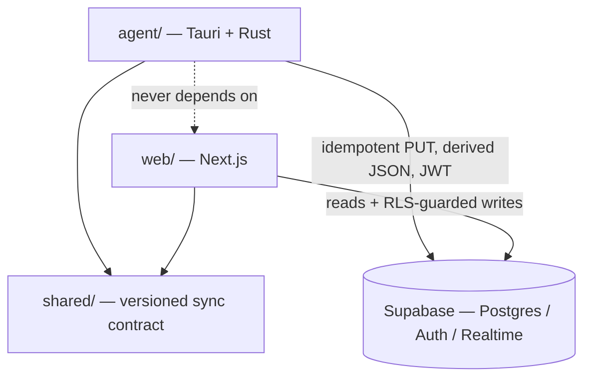
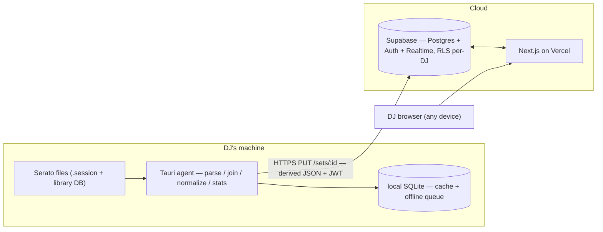
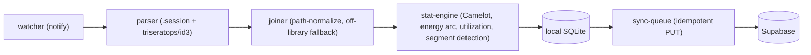
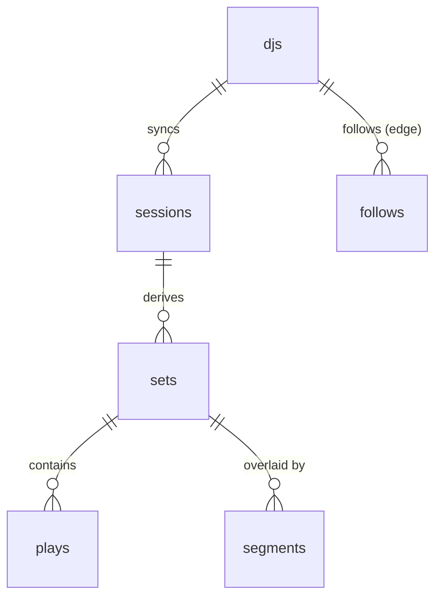

# Architecture Spine — Curfew

## Design Paradigm

**Local-first hybrid — "smart edge, thin cloud."** The DJ's machine is not a dumb uploader; it is where every expensive operation happens. The cloud is a comparatively thin store-and-serve tier plus a social graph. This is the direct architectural expression of the product's defining fact — *no paid AI or server compute is needed; all stats are arithmetic over parsed metadata* — so all that computation runs for free on hardware the business does not own.

Two units, one seam:

- **The agent** (`agent/`) is a **pipes-and-filters** pipeline: `watcher → parser → joiner → stat-engine → local store → sync-queue`. Each filter is independently testable with a typed hand-off.
- **The cloud** (`web/` + Supabase) is a **modular monolith** — one Next.js deployment over a managed Postgres, not microservices.
- The **sync boundary** between them is the single load-bearing integration in the system. A shared, versioned contract (`shared/`) governs it.

Everything below fixes the invariants of that seam and the two units it joins. The full data schema, component internals, and file tree are **seed** — true at cold-start, owned by the code once it exists.

## Invariants & Rules

Dependency direction (who may depend on whom):



**Rule:** `agent` and `web` both depend on `shared`; neither depends on the other; both reach the cloud only through the contracts above; the cloud (Supabase schema + RLS) depends on nothing upstream.

### AD-1 — Edge computes, cloud stores `[ADOPTED]`

- **Binds:** all stat/derivation features (FR-2, FR-6–FR-13, FR-15); every cloud read path.
- **Prevents:** a server-side recomputation path growing beside the edge one, so the two disagree and paid server compute creeps in.
- **Rule:** the **edge owns everything derived from raw Serato data** — parsing, the session↔library join, base per-track metadata, genre normalization, and first-pass per-set stats — and the cloud **never parses Serato binary or re-derives base metadata**. The cloud **may** run **SQL re-aggregation over already-synced `plays`**: user-defined slices (FR-15 segment-scoped stats — segments live only in the cloud, AD-6), cross-DJ **scene aggregates** (FR-24/FR-25, Phase 2), and **re-applying the genre-normalization lookup** over the stored raw genre string (AD-12, pinning one `taxonomy_version` per aggregate across a heterogeneous fleet). The line is **raw-Serato derivation (edge-only)** vs **SQL over clean synced rows (cloud-legal)** — not "no cloud compute."

### AD-2 — Raw-data boundary `[ADOPTED]`

- **Binds:** FR-3, FR-5; §5.2 Privacy; the sync payload.
- **Prevents:** the cloud ever ingesting Serato's binary format — which would pull format-coupling and raw-library privacy liability server-side.
- **Rule:** raw `.session` files and the raw library DB **never leave the machine**. Only a derived, normalized JSON document per set crosses the wire, over HTTPS. Agent filesystem access is capability-scoped to the configured Serato path only.

### AD-3 — Derived-only sync through one shared, versioned contract `[ADOPTED]`

- **Binds:** the agent↔cloud seam; `shared/`; FR-4.
- **Prevents:** agent and web independently defining incompatible payload shapes; the contract drifting between tiers.
- **Rule:** the per-set sync payload is a single versioned schema owned by the `shared/` package (TS types + JSON-schema), validated on **both** the agent (before send) and the cloud (on receive) by contract tests. The three tiers live in **one monorepo** (`agent/`, `web/`, `shared/`) precisely so this contract cannot fork. Every payload carries `agent_version`. **Contract evolution is additive-only** (new optional fields; never a breaking change to a live field), and the cloud **must accept the last N `agent_version`s** — a heterogeneous agent fleet is expected, because AD-13 backfill re-syncs sets from older agents.

### AD-4 — Idempotent sync on a deterministic `set_id`

- **Binds:** FR-4; the sync-queue filter; the backfill playbook.
- **Prevents:** duplicate sets on retry **and on re-parse/backfill** — the exact case the raw-retention story (AD-13) depends on.
- **Rule:** sync is an idempotent `PUT /sets/:set_id`. `set_id` is **deterministic and namespaced by `dj_id`** — derived as `hash(dj_id, session_identity)` (see AD-16), never minted fresh per parse (a random UUID would duplicate on backfill) and never derived from session identity alone (two DJs on a shared USB library would collide). Re-parsing the same session after a parser fix therefore **updates content** rather than duplicating. Offline sets queue durably in local SQLite and sync on reconnect (at-least-once + idempotent = no dupes). *(Architect call — research specified idempotency but left key-derivation open.)*

### AD-5 — Two stores, one owner per data class

- **Binds:** local SQLite; cloud Postgres; cross-device access.
- **Prevents:** two-owner divergence when a DJ runs the agent on more than one machine (laptop + studio, or a USB-hosted library moved between machines).
- **Rule:** **cloud Postgres is the cross-device system of record** for all synced and social data. **Local SQLite is a durable parse + offline cache** and is the source of truth for a set **only until that set has successfully synced**. *(Architect call — tightens the research's looser "local = truth for the DJ's own data," which left a two-owner hole across devices.)*

### AD-6 — Set content flows one way; user overlays are cloud-only

- **Binds:** FR-14, FR-16, FR-22, FR-23; the agent write path.
- **Prevents:** bidirectional sync and edit-conflict machinery between agent and cloud.
- **Rule:** set **content** (plays, timestamps, derived stats) flows **agent → cloud only**. User-authored **overlays** — Layer 2 enrichment (FR-16), segment edits (FR-14), per-track hide (FR-22), visibility tier (FR-23) — are authored on the web, live **only in the cloud**, and are **never written back to the agent**. The agent emits an immutable "as-played" set; overlays accrete server-side. The agent's upsert is **column-scoped to content** and never touches an overlay column (enforced per AD-16). *(Architect call.)*

### AD-7 — Per-DJ isolation is enforced at the database layer `[ADOPTED]`

- **Binds:** all DJ-owned tables; §5.2 Privacy.
- **Prevents:** a cross-DJ data leak surviving any application-code or API bug.
- **Rule:** isolation is a Row-Level Security policy, **null-safe**: `auth.uid() IS NOT NULL AND auth.uid() = dj_id`. Never application-layer filtering. Phase 2 social sharing is added as **explicit opt-in read policies** on top; isolation-by-default is never relaxed to achieve it.

### AD-8 — All cloud mutation goes through Supabase + RLS `[ADOPTED]`

- **Binds:** every write path except set sync.
- **Prevents:** a bespoke write-API that quietly bypasses RLS.
- **Rule:** web-side mutations (enrichment, hide, visibility, follow) go through Supabase (PostgREST / `supabase-js`), guarded by RLS. No custom mutation server at v1. The agent's **only** write is the idempotent set sync (AD-4).

### AD-9 — Visibility tiers + per-track redaction; plays inherit set visibility `[ADOPTED]`

- **Binds:** FR-22, FR-23; §6.2 tone.
- **Prevents:** a hidden track leaking through track-count or omission; visibility enforced only in the UI.
- **Rule:** three tiers — **public / friends-only / private** — enforced by RLS read policies. Per-track hide renders as a **redacted placeholder, never an omission** (FR-22). A `play` has **no independent visibility**; it inherits its set's tier. Default-on-sync is **public**, but this applies **only to sets synced after a DJ has joined the social layer**. **Phase 1 sets are stored private-equivalent and are never retroactively exposed when Phase 2 read-policies ship** — no historical privacy shock. A tier, once set by the DJ, is never changed by an agent re-sync (AD-16).

### AD-10 — One account across providers; agent stores tokens securely `[ADOPTED]`

- **Binds:** FR-29; §4.10.
- **Prevents:** a duplicate account per auth provider; the agent persisting a refresh token in browser-style storage.
- **Rule:** Supabase Auth (GoTrue is now its legacy internal name), JWT + refresh. Four sign-in paths (email+password, Google, Apple, passkey) **link to one `dj` account by verified email**; a phone number is required on file (prompted after Google/Apple signup); the `djs` row is 1:1 with `auth.users`. The agent persists its refresh token via **Tauri's overridable secure storage**, not browser storage. `djs`-row creation is **idempotent on verified email** — a second provider with the same verified email always links to the existing row, never creating a duplicate that would strand synced history. Accounts with **distinct** verified emails across providers are **not auto-merged in v1** (a known limitation, flagged rather than silently merged).

### AD-11 — Agent = Tauri/Rust with a two-path parser `[ADOPTED]`

- **Binds:** FR-1, FR-2; the `parser`/`joiner` filters.
- **Prevents:** parsing as a foreign-process call; floating a volatile dependency; assuming a single Serato DB format.
- **Rule:** the agent is **Tauri 2 (Rust core)**. Parsing is **two paths**: a **clean-room Rust `.session` parser** (the play log) + **`triseratops`** (MPL-2.0 confirmed; **pin an exact git commit** — the published crate is stale at `0.0.3`/2023 and upstream warns of breaking API changes) and the **`id3` crate** for the library DB and embedded tags. It must handle **both** legacy `database V2` **and** Serato 4+ `master.sqlite`. The session↔library join resolves relative-vs-absolute paths against the library root; off-library tracks fall back to embedded tags, then to a visible **"Unknown"** (never a guess, never a silent drop).

### AD-12 — Normalize genres on the edge, but store raw + normalized + taxonomy version

- **Binds:** FR-8, FR-9, FR-24.
- **Prevents:** silent cross-time trend corruption when the normalization table evolves across an already-deployed agent fleet (old sets normalized under table vN, new sets under vN+1, compared as if equal).
- **Rule:** genre normalization runs **on the agent** before sync against a Curfew-maintained fixed table (FR-8, not DJ-editable). The cloud stores **both** the raw genre string **and** the normalized value **and** a `taxonomy_version` per play, so trends (FR-9) can be recomputed consistently after the table changes. *(Architect call.)*

### AD-13 — Format-drift resilience is three layers plus backfill `[ADOPTED]`

- **Binds:** FR-1 feature NFR; §5.4 Reliability; the ops posture.
- **Prevents:** a Serato format change silently corrupting synced data with no way to recover.
- **Rule:** (1) **golden-file CI tests** against checked-in `.session` + DB fixtures catch drift pre-release; (2) **agent-side error reporting tagged with `agent_version`** detects drift that only appears on a real DJ's machine post-release; (3) a **signed static-JSON auto-updater** (Tauri) ships the fix fast. Because local SQLite retains raw data (AD-5), affected sets are **backfilled** after the fix. All three layers are required — field validation alone only covers pre-release.

### AD-14 — Cloud is a modular monolith `[ADOPTED]`

- **Binds:** `web/`; the cloud tier.
- **Prevents:** premature microservices; a hand-built socket server or custom API layer.
- **Rule:** one Next.js deployment over Supabase. The read/serve API is **auto-generated by PostgREST**; the Phase 2 scene feed rides **Supabase Realtime** (managed WebSockets), not a socket server you operate. Future service seams (heavy analytics, Rekordbox/Engine ingestion) are **named, not built** (see Deferred).

### AD-15 — Phase 1 → Phase 2 is additive, never a rewrite

- **Binds:** the whole schema + boundary set; PRD §9 phasing.
- **Prevents:** a Phase 1 shape that forces restructuring when social lands — which would forfeit the entire reason Topology B was chosen over a simpler local-only build.
- **Rule:** the Phase 1 schema, sync contract, and boundaries are chosen so Phase 2 (feed, follows, visibility tiers, comparisons) **adds** fields, RLS read-policies, and Realtime subscriptions — it never restructures existing tables or the sync contract. **Enforcement arm:** schema changes ship as **additive-only Supabase-CLI migration files committed in the monorepo**; a migration that drops/renames a live column or breaks the sync contract violates this AD. *(This is a product-phase invariant, distinct from the engineering build-sequence: parser → local app → sync → web → social.)*

### AD-16 — Session is the immutable anchor; sets & overlays key off it; the agent upsert is content-only

- **Binds:** FR-1, FR-4, FR-14–FR-16, FR-22, FR-23; the sync upsert; AD-4, AD-6, AD-9.
- **Prevents:** a parser/boundary fix orphaning overlays or silently re-exposing a private set; two DJs on a shared USB library colliding on one set; an idempotent content re-sync clobbering web-authored visibility/enrichment.
- **Rule:**
  - The **session** (one Serato session file) is the immutable identity anchor: `session_id = hash(dj_id, stable_session_identity)` — **namespaced by `dj_id`** so a shared USB library cannot collide across DJs (AD-4).
  - A **set** is a product unit derived from a session (Glossary §3). Set boundaries, **once synced, are stable in the cloud**: a re-parse/backfill updates play-level content keyed by `session_id` but **does not re-partition or re-key** an already-synced session. Correcting boundaries is a **deliberate cloud-side migration**, never an implicit consequence of re-sync.
  - The agent's sync upsert is **column-scoped to content columns**. User-authored **overlay** columns — visibility tier, per-track hide, Layer 2 enrichment, segments — are **disjoint and never written by the agent** (the mechanical enforcement of AD-6, contract-tested in `shared/`). An idempotent re-sync can therefore never reset a tier (AD-9) or wipe an overlay.

### AD-17 — Segment detection: density + DJ-relative BPM floor, confirmed by transition-smoothness `[ADOPTED]`

- **Binds:** FR-14, FR-15, FR-27, FR-28; the agent's stat-engine filter; segment suggestion (feeds AD-6's web-authored overlay).
- **Prevents:** a fixed global BPM/gap constant that fits one DJ's genre and silently misfires on another; assuming every session has exactly one dancefloor block to find; a coincidentally similar-tempo non-mixed block (dedications, ambiance) being misread as a real set.
- **Rule:** the agent buckets a session into fixed time windows and computes, per window, **play density**, **median BPM**, and the **fraction of consecutive track-pairs with a small BPM delta** (a continuity/beatmatching proxy). A window is a dancefloor *candidate* only if density and BPM clear floors **calibrated per-DJ from that DJ's own historical plays** — never a hardcoded global constant (a house DJ's floor sits far above a hip-hop DJ's). Adjacent candidates merge into a segment, which is **confirmed** only once its transition-smoothness clears its own floor: validated against the real session corpus, an isolated non-mixed ceremony stretch measured ~42% smooth transitions against ~65–78% for confirmed real mixed sets, so smoothness is used as a **confirming gate**, not the primary signal — it did not separate cleanly on its own in every case tested (a formalities block can coincidentally score as "smooth" too). Long no-play stretches collapse to an **idle/gap** marker, never a forced segment. **A session yields zero, one, or several dancefloor segments — never assumed to be exactly one**: validated against a real 8.6-hour session that bundled a morning dancefloor block, a multi-hour non-dancefloor stretch, and a separate evening dancefloor block, because Serato was never closed between the underlying real-world events (e.g. a baraat, then the ceremony, then the reception). *(Architect call, validated 2026-07-20 against the real 474-session local corpus — resolves SM-1/OQ#1.)*

## Consistency Conventions

| Concern | Convention |
| --- | --- |
| Entity naming | `djs`, `sets`, `plays`, `segments`, `follows` (plural, snake_case). A `Session` is Serato's file-level unit; a `Set` is the product unit derived from it (Glossary §3) — never conflated. |
| IDs | UUID. `set_id` is agent-generated and **deterministic** (AD-4); all others DB-generated. `dj_id` = `auth.uid()`. |
| Dates / times | UTC ISO-8601 on the wire; `played_at` sourced from the session file. |
| Sync payload | The `shared/` versioned schema is the only contract shape; `agent_version` on every set (AD-3). |
| Unknown data | Missing metadata renders as a visible **"Unknown"**, carrying the `in_library` flag — never omitted, never guessed (AD-11; SM-C1 keeps the Unknown rate honest). |
| Cloud mutation | Supabase/PostgREST + RLS only; agent writes only via idempotent set sync (AD-8). |
| Auth / tokens | Supabase JWT + refresh; agent token in Tauri secure storage (AD-10). |
| Errors (agent) | Reported to error tracking tagged with `agent_version` (AD-13); user-facing copy is calm/technical per EXPERIENCE.md Failure Register ("Sync interrupted. Retrying automatically."). |
| Errors (wire/API) | JSON error envelope `{ code, message }` (PostgREST/Supabase error shape); the agent maps these to the calm Failure-Register copy — never surfaces a raw provider error. |
| Enums (canonical values) | `visibility` ∈ {`public`, `friends_only`, `private`}; segment `type` ∈ {`dancefloor`, `dinner`, `performance`, `custom`}; `source` = `serato` (v1). Fixed strings, defined once in `shared/`. |

## Stack

*Seed — verified current at authoring; the code owns this once it exists.*

| Name | Version |
| --- | --- |
| Tauri | 2.x |
| Rust | stable (agent core + parsers) |
| triseratops | pinned **git commit** (MPL-2.0; crates.io latest `0.0.3` is stale/2023) |
| id3 (crate) | current |
| Local store | SQLite (via Tauri/Rust) |
| Next.js | 16 |
| React / TypeScript | current |
| Supabase | Postgres + Auth + Realtime + Storage |
| Web host | Vercel |
| CI / release | `tauri-action` (GitHub Actions) |
| Update feed | static-JSON on GitHub Releases / S3 |

> Verify current versions and code-signing pricing (Apple Developer Program; Windows OV/EV cert) before committing a launch budget — the two signing identities are the dominant *fixed* cost, not infrastructure.

## Structural Seed

**System / container topology:**



**Agent pipeline (pipes-and-filters):**



**Core entities (names + relationships; attributes that are invariants live in the ADs, not here):**



- The **session** is the immutable anchor keyed `hash(dj_id, session_identity)` (AD-16); a `set` is derived from it. `sets` carries a denormalized `derived` (jsonb) render-cache so dashboards render without recomputation; `plays` rows are the normalized record and carry `in_library`, raw + normalized genre, and `taxonomy_version` (AD-12). **Content columns (agent-written) and overlay columns (web-written: `segments`, enrichment, hide, visibility) are disjoint** (AD-16); overlays are cloud-only (AD-6). `follows` + shared-set read policies are the Phase 2 additions (AD-15).

**Deployment & environments:**

| Component | Runs on | Distribution / notes |
| --- | --- | --- |
| Agent | DJ's machine (macOS + Windows) | Signed installers (Apple Developer ID + Windows OV/EV) via GitHub Releases/S3; Tauri signed auto-updater; separate mandatory update-signing keypair. Zero server cost. |
| Web app | Vercel | Next.js SSR/ISR; free/low tier at launch. |
| Backend | Supabase (managed) | Postgres + Auth + Realtime + Storage; self-hostable later (no lock-in) — not v1. |
| CI/CD | GitHub Actions (`tauri-action`) | Cross-platform signed builds + auto-generated updater JSON/`.sig`; signing certs + updater key as encrypted CI secrets. |

> **Environments & migrations (decided 2026-07-20):** a dedicated Supabase **prod** project + **preview branches** for dev/PRs; schema changes ship as **Supabase-CLI migration files committed in the monorepo**, additive-only — the enforcement arm of AD-15.
> **Backup / DR:** Supabase managed backups (PITR on the paid tier) protect the cloud system of record; a DJ's **local SQLite is a secondary recovery source** for their own sets (AD-13).
> **Abuse / rate-limiting:** rely on Supabase's built-in auth/API rate limits + RLS at v1 (AD-8 forbids a custom server); revisit dedicated throttling on `PUT /sets/:id` and social writes at scale.

**Source tree (scaffold, not a mirror to maintain):**

```text
curfew/
  agent/     # Tauri 2 + Rust — pipeline, parsers, local SQLite, sync-queue, tray UI (FR-5)
  web/       # Next.js 16 — marketing, auth, dashboard, (Phase 2) feed/profile/comparisons
  shared/    # versioned sync-contract types + JSON-schema (the agent↔cloud seam)
```

## Capability → Architecture Map

| Capability / Area | Lives in | Governed by |
| --- | --- | --- |
| Serato parsing & auto-sync (FR-1–FR-5, FR-27) | `agent/` | AD-1, AD-2, AD-4, AD-11, AD-13, AD-16, AD-17 |
| Personal dashboard, style evolution, library utilization (FR-6–FR-13) | `agent/` (compute) → `web/` (render) | AD-1, AD-5, AD-12 |
| Set segments (FR-14, FR-15, FR-28) & Layer 2 enrichment (FR-16–FR-18) | `agent/` (suggest) + `web/` (author overlays); FR-15 stats via cloud SQL | AD-1, AD-6, AD-16, AD-17 |
| Account & auth (FR-29) | `web/` + Supabase Auth | AD-10 |
| Social feed / follow / profile / comments (FR-19–FR-21, FR-26) — Phase 2 | `web/` + Supabase Realtime | AD-14, AD-15 |
| Per-track hide & visibility (FR-22, FR-23) — Phase 2 | Supabase (RLS) + `web/` (render) | AD-7, AD-9 |
| Community comparisons (FR-24, FR-25) — Phase 2 | Supabase (SQL over shared sets) | AD-1 (scene-aggregate exception), AD-7 |
| Per-DJ isolation / privacy (§5.2) | Supabase RLS | AD-7, AD-8 |

## Deferred

- **Live/streaming watch mode** — v1 is post-set batch (FR-4, ADR-5); live enables a future "now playing" presence. Defer: adds real-time state + partial-set handling.
- **`pg_graphql`** — until the social graph needs deeply nested queries; PostgREST covers v1.
- **Microservice seams** — heavy analytics and Rekordbox/Engine ingestion are named future seams, not v1 services (AD-14).
- **Supabase self-hosting** — available (no lock-in) but not v1.
- **Message queue / broker** — not until write volume far exceeds one-sync-per-set-per-DJ.
- **Rekordbox support** — v2 (PRD §8).
- **Reverse-geocoding provider (FR-18)** — Google Places / Apple Maps / OSM Nominatim; cost/accuracy/attribution tradeoff, deferred to implementation.

## Open Questions

1. ~~**Set-boundary detection & segmentation**~~ **RESOLVED (2026-07-20)** — validated against the real 474-session corpus (see AD-17): a density + DJ-relative-BPM-floor heuristic, confirmed by transition-smoothness, correctly found the dancefloor-open point in a real wedding, correctly classified pure club sets as dancefloor-throughout, and correctly split a single 8.6-hour bundled session into a real dancefloor block, a non-dancefloor ceremony block, and a second dancefloor block. Closes SM-1/brief O-4.
2. ~~**"Date added to library" field**~~ **RESOLVED (2026-07-20)** — inspection of a real `database V2` (929 tracks) found `tadd` present at **~94% coverage** (plus `uadd` timestamp form). Library Utilization (FR-11–13) is buildable; it needs a graceful fallback for the ~6% missing (per the "Unknown" convention).
3. **WAV embedded-tag fallback** — the one real off-library play sampled was a `.wav`; WAV genre coverage measured 0% and WAV embedded-tag readability is unconfirmed. FR-2's fallback may hit "Unknown" disproportionately for WAV.
4. **FR-6 "most played artists"** has no defined Unknown-fallback for the ~11% artist-tag gap — decide display behavior. (Architect proposal on the table: exclude no-artist plays from the ranking + an honest "N plays untagged" footnote per SM-C1 — proposed, still awaiting Arjun's nod.)
5. **Reverse-geocoding provider (FR-18)** unchosen (see Deferred).
6. ~~**Formal GDPR/CCPA-equivalent privacy review**~~ **PARTIALLY RESOLVED (2026-07-20)** — launch geography decided: **US-only at launch**, so a CCPA-level posture is sufficient at v1 and a GDPR-equivalent review is deferred until international expansion is real. The formal CCPA-compliance review itself is still an outstanding pre-launch checklist item, not an open architecture question.
7. ~~**Environment separation + migration strategy**~~ **RESOLVED (2026-07-20)** — dedicated Supabase prod project + preview branches; additive-only Supabase-CLI migrations in the monorepo (enforcement arm of AD-15). See Deployment & environments.
</content>
