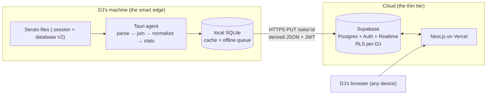
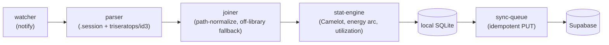
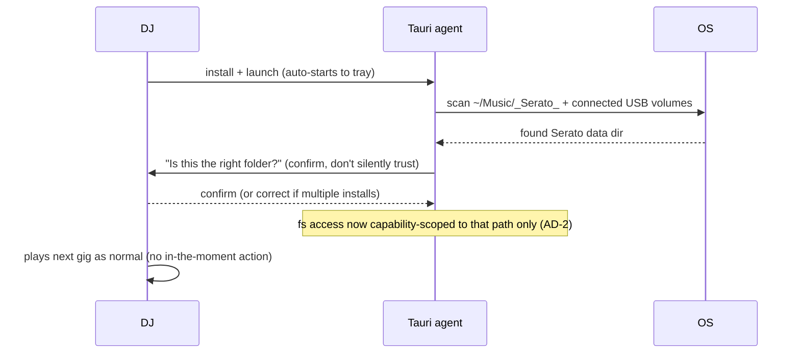
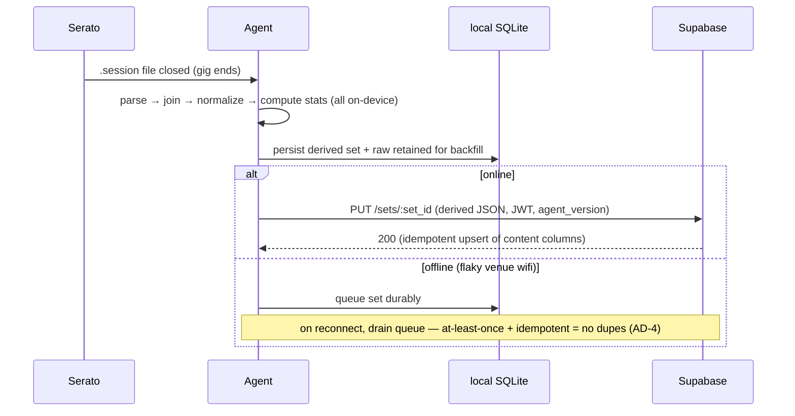
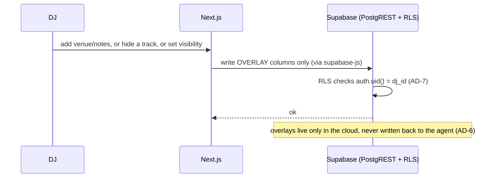
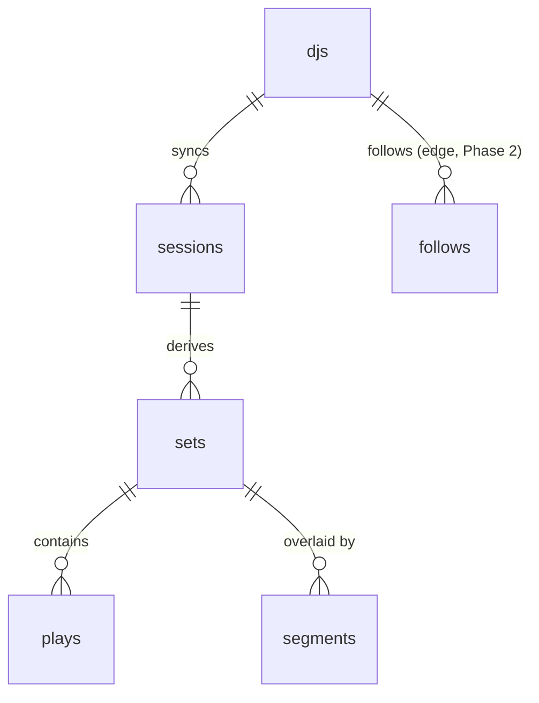
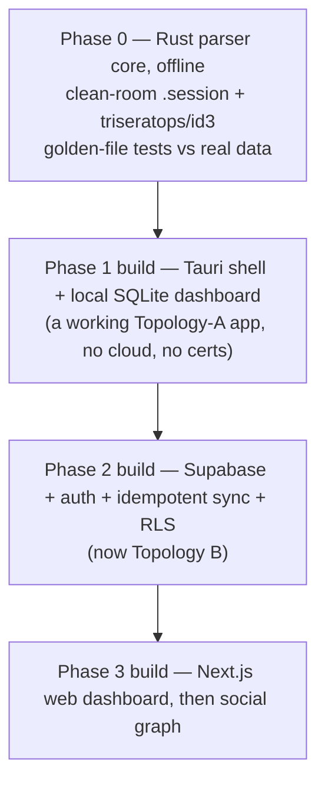

# Curfew — Solution Design

> **Read this with [`ARCHITECTURE-SPINE.md`](ARCHITECTURE-SPINE.md).** The spine is the terse contract of invariants (AD-1…AD-17) that downstream work must not violate. This document is the human-readable companion: the *shape*, the *flows*, and the *why*. Where the two ever disagree, **the spine wins** — it is the build substrate; this is the walkthrough.

---

## 1. The shape in one paragraph

Curfew is **not one app**. It is a **two-tier "smart edge, thin cloud"** system. A small **Tauri/Rust agent** runs on the DJ's own machine, because Serato writes its data only there. The agent does all the hard work — parsing Serato's binary files, joining the play log to the library, computing every stat — and syncs **only a derived, normalized JSON document per set** to the cloud. The cloud (**Supabase** Postgres + a **Next.js** web app on Vercel) is a comparatively thin store-and-serve tier plus, in Phase 2, a social graph. This shape is the direct consequence of the product's defining fact: *no paid AI is needed; every stat is arithmetic over parsed metadata* — so all that compute runs for free on hardware Curfew doesn't own, and the raw library never has to leave the DJ's machine.

Everything else in this document is an elaboration of that paragraph and the single seam it hinges on — the **sync boundary** between agent and cloud.

## 2. The two tiers and the seam



**Why the boundary sits exactly here** (the research evaluated three placements — fully-local, hybrid, full-cloud — and chose hybrid, "Topology B"):

- Push it *further out* (full-cloud, raw files uploaded) and the cloud inherits Serato's fragile binary format and the privacy liability of every DJ's full library. Rejected.
- Pull it *further in* (fully-local, nothing syncs) and there is no website and no path to the social network. Rejected.
- **Hybrid** keeps raw data on the machine, sends only clean derived rows, and is the *only* option that reaches the Phase 2 social network **without a rewrite** — the sync contract simply carries more (opt-in) fields over time. Chosen (AD-1, AD-2).

The agent is a **pipes-and-filters** pipeline; each stage is independently testable with a typed hand-off:



## 3. The flows that matter

The invariants earn their keep in a handful of specific flows. These are the ones worth drawing.

### 3.1 First-run setup (UJ-3)



The zero-setup promise is one confirmation, then invisible forever. The **USB case is first-class**, not an edge case — many DJs keep their whole Serato library on a drive (FR-1), and the agent resumes watching automatically on reconnect.

### 3.2 Post-set sync — the happy path and the offline path



Key point: **`set_id = hash(dj_id, session_identity)`** (AD-4, AD-16). It is deterministic — so a retry or a re-parse targets the same row — and namespaced by `dj_id`, so two DJs sharing one USB library can't collide.

### 3.3 Backfill after a Serato-format break — the recovery story

This is the flow the whole local-first design exists to make possible.

```mermaid
sequenceDiagram
  participant Serato as Serato (updates, breaks format)
  participant Agent
  participant Sentry as error tracking
  participant CI
  participant Cloud
  Serato->>Agent: format change → parse fails on real machines
  Agent->>Sentry: parse error, tagged agent_version
  Note over CI: golden-file tests already catch most drift pre-release;<br/>Sentry catches what only appears in the wild
  CI->>Agent: ship parser fix via signed auto-updater
  Agent->>Agent: re-parse from RAW data retained in local SQLite
  Agent->>Cloud: re-sync (same deterministic set_id → UPDATE, not duplicate)
  Note over Cloud: content columns updated; visibility/enrichment overlays untouched (AD-16)
```

Two invariants make this safe rather than destructive:
- **Deterministic `set_id`** means the re-sync updates the existing set instead of creating a duplicate (AD-4).
- **Column-scoped content upsert** means the re-sync touches only content columns and *never* a user-authored overlay — so a backfill can't silently reset a DJ's private set to public or wipe their enrichment (AD-16). This was a hole the adversarial review found; it is now closed.

### 3.4 A web-authored overlay (enrichment / hide / visibility)



Content flows **one way** (agent → cloud). Overlays are authored on the web and **stay** in the cloud. The agent emits an immutable "as-played" set; user meaning accretes on top of it server-side. There is deliberately **no bidirectional sync** and therefore no edit-conflict machinery to build.

### 3.5 Reading a set — where each stat is computed

A subtle but load-bearing rule (AD-1, reframed during review): the edge owns everything derived from **raw Serato data**; the cloud may run **SQL over already-synced clean rows**.

| Stat | Computed where | Why |
|---|---|---|
| Per-set summary, energy arc, Camelot (FR-6/7) | **Edge**, at sync | Derived from raw play log + library join |
| Style evolution trend (FR-9) | Edge base values; **cloud** may re-normalize genre over stored raw string when the taxonomy table changes | Keeps cross-time trends consistent across a heterogeneous agent fleet (AD-12) |
| Segment-scoped stats (FR-15) | **Cloud SQL** over synced `plays`, sliced by cloud-only segment boundaries | Segments are web-authored overlays; can't be edge-computed, and it's cheap SQL |
| Community comparisons (FR-24/25, Phase 2) | **Cloud SQL** over shared sets | Inherently cross-DJ; can't be edge-computed |

The line is **"cloud never parses Serato binary or re-derives base metadata,"** not "cloud never computes." That reframe is what gives FR-15 and the taxonomy re-normalization a legal home.

### 3.6 Finding the dancefloor — segment detection (AD-17)

FR-14/FR-28 need the agent to *suggest* where a set's "dancefloor" segment actually starts (vs. cocktail hour, dinner, formalities) — the DJ then confirms/adjusts on the web (AD-6). This was SM-1, the architecture's highest-uncertainty risk, and it was validated directly against Arjun's real 474-session Serato history rather than left as an assumption.

**What the validation found:**

- A real wedding's dancefloor-open point is genuinely findable from play density + BPM alone — it shows up as a sustained climb out of a low-density, low-BPM trough (cocktail/dinner/formalities).
- But that shape **isn't universal**: several real club sets were dancefloor-energy from the very first track, with no "before" phase to find at all. The heuristic must be able to return "dancefloor from minute one" or, symmetrically, "no dancefloor segment at all" (a ceremony-only session) — never force a fixed three-phase shape onto every session.
- A single very long session can legitimately bundle **multiple separate real-world events** with a non-dancefloor stretch between them — validated against a real 8.6-hour file that turned out to be a morning dancefloor block (baraat), a multi-hour non-dancefloor block (the ceremony itself), and an evening dancefloor block (the reception), all in one file because Serato was never closed in between.
- Consecutive-track BPM-jump smoothness (a beatmatching/continuity proxy) is real signal — an isolated non-mixed stretch measured ~42% "smooth" transitions vs. 65–78% for confirmed real mixed sets — but it's noisy enough on its own that it's used as a **confirming gate** on top of density + BPM, not the primary signal.

**The resulting algorithm** (AD-17): bucket the session into fixed time windows; a window is a dancefloor *candidate* if density and median BPM clear floors **calibrated from that DJ's own historical plays** (not a fixed constant — genres run at very different tempos); adjacent candidates merge into a segment, confirmed only if its transition-smoothness clears its own floor; long dead stretches become an idle/gap marker; a session can yield zero, one, or several dancefloor segments.

## 4. Data model (narrative)



- **`session`** — the immutable anchor, keyed `hash(dj_id, session_identity)`. One Serato session file. Everything hangs off this because it's the one identity that survives a re-parse (AD-16).
- **`set`** — the product unit derived from a session (a session may be split into sets by set-detection). Once synced, its boundaries are **stable in the cloud**; correcting them is a deliberate migration, never a silent side effect of re-sync.
- **`plays`** — the normalized record: one row per played track, carrying `in_library`, **both** raw and normalized genre plus `taxonomy_version` (AD-12), BPM, key, Camelot.
- **Overlay columns / tables** — `segments`, enrichment, per-track hide, visibility tier. **Web-authored, cloud-only, disjoint from content columns** (AD-6, AD-16). This disjointness is contract-tested in `shared/`.
- **`follows`** + shared-set RLS read policies — the *only* structural additions Phase 2 needs (AD-15).

**Two stores, one owner per data class (AD-5):** cloud Postgres is the cross-device system of record; local SQLite is a durable parse + offline cache and is authoritative for a set *only until it syncs*. That wording matters — it's what stops a DJ's laptop and studio machine from becoming two conflicting owners of the same history.

## 5. Security & privacy posture

- **The strongest control is non-transmission.** Raw libraries never leave the machine (AD-2), so the most sensitive data has no cloud attack surface at all.
- **Per-DJ isolation is enforced in the database, not the app** — a null-safe RLS policy `auth.uid() IS NOT NULL AND auth.uid() = dj_id` (AD-7). A bug in application code cannot leak one DJ's data to another, because the filter is below the app.
- **All cloud writes go through Supabase + RLS** (AD-8); there is no bespoke API server to get the policy wrong in.
- **Privacy is not retroactive.** Phase 1 sets are stored private-equivalent and are **never** bulk-exposed the day Phase 2's read policies ship (AD-9) — a privacy shock the adversarial review caught.
- **Agent filesystem access is capability-scoped** to the configured Serato path; the agent can read that folder and nothing else it isn't granted.
- **Auth tokens** live in Tauri's secure storage on the agent, not browser storage (AD-10).
- **Launch geography decided: US-only.** A CCPA-level posture is sufficient at v1; GDPR-equivalent review is deferred until international expansion is real. **Open:** the formal CCPA-compliance review itself is still advised before public launch and has not been done (see §8).

## 6. Build sequencing vs. product phasing

These are **two different axes** and conflating them is a classic mistake.

**Engineering build-sequence** (riskiest-first; each step is shippable/validatable on its own):



**Product phasing** (from the PRD, gated on validation, not calendar):

- **Phase 1 (Launch)** — personal reflection: agent + sync + web dashboard. **No social.**
- **Phase 2 (Fast-Follow)** — social feed, follows, visibility tiers, comparisons. Gated on Phase 1 clearing SM-1 (parsing correctness) and SM-2 (personal value stands alone).

The architecture's **no-rewrite guarantee (AD-15)** is the bridge between them: Phase 2 *adds* fields, RLS policies, and Realtime subscriptions — it never restructures what Phase 1 built. Enforced by additive-only Supabase-CLI migrations committed in the monorepo.

> Note the productive tension the PRD is honest about: the primary paying persona (club DJs) has a JTBD that's largely about the *scene*, which Phase 1 doesn't deliver. SM-2 is the real test of whether personal reflection alone holds that persona — a risk to watch, not one the architecture can resolve.

## 7. Cost & operations

- **Marginal server cost ≈ $0.** Parsing and stats run on DJs' machines. The cloud write path is one sync per set per DJ — modest even at thousands of DJs.
- **The dominant *fixed* cost is code-signing**, not infrastructure: an Apple Developer Program membership (macOS notarization) + a Windows OV/EV certificate. *Verify current pricing before committing a launch budget.*
- **Ops posture is almost entirely managed** — no servers to patch, no queue to babysit. Cross-platform signed builds + the updater feed are produced by one `tauri-action` CI workflow.
- **The one operational signal that matters:** the agent's parse-error rate, broken down by `agent_version`. A spike is the leading indicator that Serato changed its format. The incident playbook is §3.3: patch → auto-update → backfill.
- **Environments:** a dedicated Supabase prod project + preview branches for dev/PRs; migrations are additive-only CLI files in the monorepo (also the enforcement arm of AD-15). Backup/DR rides Supabase managed backups (PITR on the paid tier), with a DJ's local SQLite as a secondary recovery source.

## 8. Risks & open questions

**Resolved during this architecture pass:**
- ✅ **Set-boundary / dancefloor-segment detection** (was blocking SM-1). Validated against the real 474-session corpus — see §3.6 and AD-17.
- ✅ **"Date added to library" field** (was blocking Library Utilization FR-11–13). Inspection of a real `database V2` found `tadd` present at **~94% coverage** — buildable, with a graceful "Unknown" fallback for the ~6% gap.
- ✅ **Environments / migrations** — decided (§7).
- ✅ **`triseratops` license** — MPL-2.0 confirmed from source (safe for a proprietary product); pin a git commit, not the stale `0.0.3` crate.
- ✅ **Launch geography** — decided **US-only at launch**; a CCPA-level posture is sufficient at v1, GDPR-equivalent review deferred until international expansion is real. (The formal CCPA-compliance review itself remains a pre-launch checklist item.)
- ✅ **FR-6 "most played artists" Unknown-fallback** — decided (Arjun): rank artist-tagged plays only, no "Unknown" bucket and **no** "N untagged" footnote. Untagged plays still count in every non-artist stat and still show as "Unknown" in the tracklist (AD-11), so SM-C1 honesty rides the tracklist, not the leaderboard. Recorded as SPEC-name-pending CAP-5.

**Still open (what's needed to close each):**

| # | Open question | What closes it | Owner |
|---|---|---|---|
| 3 | WAV off-library embedded-tag readability | A WAV test file; or confirmation that target libraries are WAV-heavy enough to matter | Arjun / measurement |
| 5 | Reverse-geocoding provider (FR-18) | A lean on cost vs accuracy vs attribution-freedom; or defer (opt-in, off by default) | Arjun (or defer) |

What's left is decidable during implementation or deferrable — nothing left blocks moving to epics/stories.

## 9. Where the decisions live

- **The 16 invariants** (with Binds / Prevents / Rule, and which are `[ADOPTED]` vs architect calls): [`ARCHITECTURE-SPINE.md`](ARCHITECTURE-SPINE.md).
- **The full decision trail** (every decision, constraint, version, open question, and the reviewer-gate outcome): `.memlog.md` in this folder.
- **The reviewer-gate reviews** (adversarial, tech-currency, good-spine rubric): `reviews/` in this folder.
</content>
